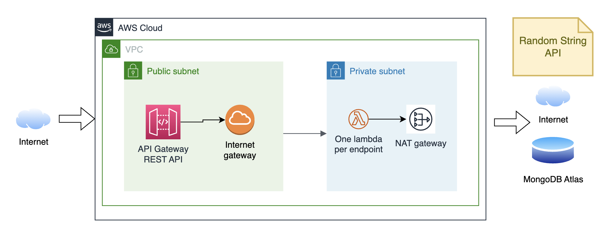

# Serverless Calculator REST API

Demonstrates the usage of the [serverless framework](https://www.serverless.com/) to build a REST API in a serverless cloud environment.

## Environment setup

Needs Node 18.5. If you use [NVM](https://github.com/nvm-sh/nvm/blob/master/README.md) to manage your node version, on the project root folder run:

`nvm use`

## Running locally

To run the application locally, you will need a local MongoDB installation. We provide a script and docker-compose file to spin up a cluster with three nodes, which is required to use transactions in MongoDB.

For the local MongoDB cluster, we need to add the below line in the `/etc/hosts` file

`127.0.0.1 mongo1`

Now we are ready to spin up the cluster:

`./startMongo.sh`

It will take a few seconds to spin up and set up the cluster and the initial DB users and collections. If you want to shutdown the cluster just run:

`./stopMongo.sh`

Now you are ready to run the serverless framework locally and simulate AWS resources like the API Gateway and the Lambda functions.

`npm start`

You will see the local endpoint URLs in the terminal.

The data used to seed the local db can be found [here](./docker/data/). The default passwords for the users is `demo`

## Running tests

`npm test`

> **Warning**
>
> As there are a few mongo db integration tests, it will destroy the initial data, so if you want to run the app locally, you should stop and start the mongo db cluster.

These are some of the libraries we use for tests:

- Jest
- nock. To mock/assert HTTP interactions.

## Deploy to cloud

To deploy the project on your own AWS account, you need to follow the instructions on the serverless [documentation](https://www.serverless.com/framework/docs/guides/parameters#creating-serverless-dashboard-parameters) and then run the following:

`npm run deploy`

Be aware that you must set up the `MONGODB_URL` parameter as described in serverless documentation to complete this step successfully.

After a successful deployment, you will see the public endpoint URLs in the terminal.

## Architecture

We use public and private subnets to reduce the attack surface and expose the minimum resources necessary.

A public subnet hosts the API Gateway, which communicates with the private subnet through the Internet Gateway.

Lambdas are placed within a private subnet with Internet access (NAT Gateway) to consume external APIs and the MongoDB cluster hosted in Atlas.

### TODOs (Architecture)

For this sample application, I used an Atlas MongoDB cluster to have a Mongo cluster in the cloud quickly and easily operate on it (accessible from anywhere). But a more secure and performant approach would be setting up an AWS DocumentDB instance in a private subnet.

Another thing we should add for a production application is a WAF (web application firewall) to increase security and availability; this would sit in front of the API Gateway.

## Development

### Decisions

Opted for the Serverless framework as it provides code and serverless-centric infrastructure management in one place.

I picked NodeJS as I think it would be a better fit for the Lambda platform as it is much lighter and has less memory footprint than Java.

I went for a Lambda per endpoint approach mainly for these reasons:

- Lambda concurrency model: Each Lambda instance processes one request at a time, so if multiple requests are received, more Lambda instances will be instantiated (or requests may be queued up). So the lighter the function is, the better.

- Allocated IP: This affects the lambda that interacts with the 3rd party random string generator API ([which discourages concurrent requests from the same IP](https://www.random.org/clients/)). Lambdas with Internet access need an allocated IP which many instances will share. Therefore the need to control the concurrency for this particular lambda function.

I chose MongoDB as my data store as it covers all the requirements plus allows quick development iterations. I'm also using db transactions,  which requires a MongoDB cluster with at least three nodes.

I'm using the middy library, which brings the NodeJS middleware engine into the Lambda world. It provides many features out of the box, like validation, error handling, request parsing and more.

Finally, I'm using a circuit breaker to interact with the 3rd party random string API so that we don't overload the downstream service in case of errors (run out of credits, server down, etc.). I wrote a custom implementation to support exponential wait times between failure calls, as recommended by <https://www.random.org/clients/>

### Best Practices

- SOLID
- Hexagonal architecture
- TDD
- Avoid storing plain passwords: <https://www.makeuseof.com/nodejs-bcrypt-hash-verify-salt-password>

### TODOs (Development)

- integration and e2e tests
- enable tests coverage report and see the numbers
- expose OpenAPI spec for the endpoints
